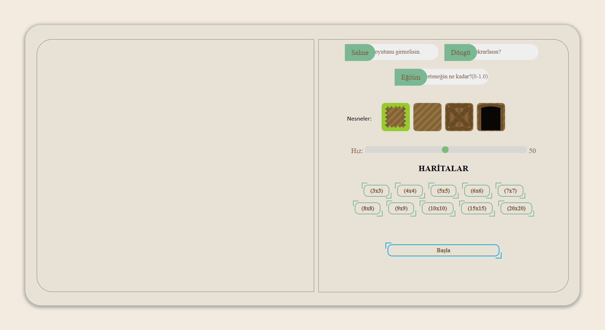
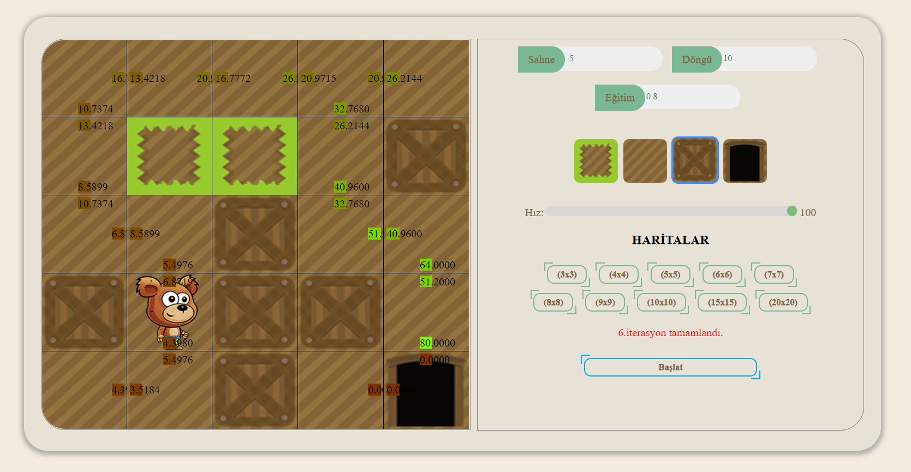
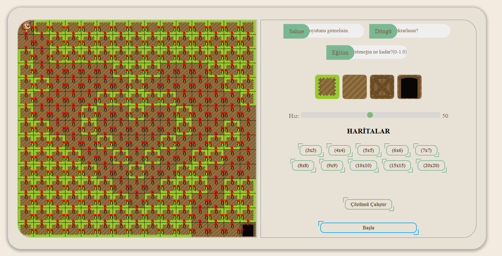
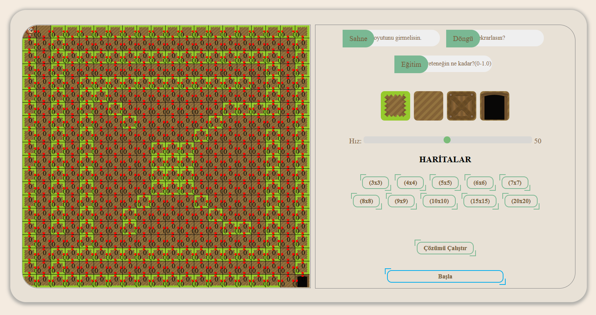

###Yapay Zeka ile Labirentten Kaçma Oyunu

###### Ödüllü öğrenme (Reinforcement Learning) uygulamalarından biri olan Q Learning  uygulamasıdır.
                
----
Uygulama arayüzü:

- **Sahne:** Labirentin boyutunu temsil eder. (nxn) boyutunda matris yaratılacaktır. **n:** Sahne girdisi.
- **Döngü:** Algoritmanın kaç adım çalışacağının belirtilmesidir.
- **Eğitim:** Algoritmanın öğrenme hızının belirlenmesidir. 0-1 arasında ondalıklı (format: 1.0) değer alır.
- **Nesneler:** Yaratılan harita üzerine yerleştirilen nesneleri temsil eder. Kahraman toprak yolda ilerler ve hedefi kapıya ulaşmaktır. Kutu ve çalılıklardan geçemez.
- **Hız:** İterasyonları gerçekleştirecek olan kahramanın hızını temsil eder.
- **Haritalar:** Önceden hazırlanmış haritaları içerir. Kullanıcı yukardaki nesneleri kullanmadan ve matris boyutu girmeden harita seçebilir. Ayarların ilk değerlerini değiştirebilir.
- **Çözümü çalıştır:** Haritanın önceden çözülmüş olan sonucu getirir. Sonuca göre yollardaki yönlerin ağırlıkları güncellenir.
- **Başla:** Girilen değerlere ve yaratılan haritaya göre algoritma çalıştırılır.

###Arayüz görselleri
                
----

